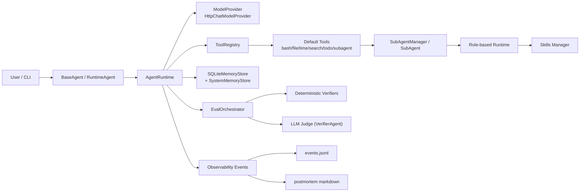

# InDepth 技术架构说明

InDepth 是一个以“可执行、可观测、可验证”为核心目标的本地 Agent Runtime 项目。  
它不是单纯的对话壳，而是一个包含 **运行时调度、工具调用、子代理协同、结果验证、观测复盘、系统记忆闭环** 的最小可用闭环。

---

## 1. 项目目标

本项目主要解决 3 个工程问题：

1. 如何把 LLM 对话转成可执行流程（Tool Calling + Runtime Loop）
2. 如何让执行过程可审计（事件埋点 + 指标聚合 + 时间线）
3. 如何让“回答完成”与“任务完成”区分开（Eval + VerifierAgent）

对应代码主线：

- 运行时：`app/core/runtime/agent_runtime.py`
- 工具体系：`app/core/tools/*` + `app/tool/*`
- 评估体系：`app/eval/*`
- 可观测性：`app/observability/*`
- 记忆体系：`app/core/memory/*`

---

## 2. 快速开始

### 2.1 三步跑通

1. 安装依赖
   - `pip install -r requirements.txt`
2. 配置模型环境变量
   - `LLM_MODEL_ID` / `LLM_MODEL_MINI_ID`
   - `LLM_API_KEY` / `LLM_BASE_URL`
3. 启动 Runtime CLI
   - `python app/agent/runtime_agent.py`

---

## 3. 分层架构总览



InDepth 采用“自上而下约束、自下而上反馈”的分层架构，不依赖外部框架叙事，重点是可执行闭环的原创工程组织方式。

### L1 协议与目标层（Why）

- 位置：`InDepth.md`
- 职责：定义任务启动、时效检索、拆解边界、收敛标准、风险门禁。
- 作用：先统一行为协议，再进入执行，避免“模型即流程”的不稳定性。

### L2 编排与运行时层（How）

- 位置：`app/agent/*.py` + `app/core/runtime/*`
- 职责：管理多步推理循环、tool-calling、停止原因、失败收敛、执行追踪。
- 核心对象：`AgentRuntime`，负责把对话转成可控执行流。

### L3 能力执行层（Do）

- 位置：`app/core/tools/*` + `app/tool/*` + `app/core/skills/*`
- 职责：提供可组合能力（工具、子代理、技能、todo 工作流）。
- 特点：能力可插拔，调用可审计，权限可按角色收敛。

### L4 评估与观测层（Check）

- 位置：`app/eval/*` + `app/observability/*`
- 职责：区分“回答完成”和“任务完成”，并沉淀完整执行证据。
- 机制：Deterministic Verifier + VerifierAgent + 事件/指标/时间线/复盘联动。

### L5 记忆与资产层（Learn）

- 位置：`app/core/memory/*` + `db/*` + `app/skills/memory-knowledge-skill/references/*`
- 职责：管理会话记忆、系统记忆、经验卡沉淀与复用。
- 闭环：运行中捕获候选，任务结束强制固化，形成可检索经验资产。

---

## 4. 端到端执行链路

一次标准调用（`runtime.run(...)`）的时序如下：

1. 构建消息上下文  
   - system prompt = Runtime 基础提示 + 业务提示 + skill prompt
   - 读取历史消息（`SQLiteMemoryStore.get_recent_messages`）
2. 拉取工具 schema 并请求模型  
   - `ModelProvider.generate(messages, tools, config)`
3. 解析模型 finish_reason  
   - `tool_calls`：执行工具并将工具结果回注到消息
   - `stop`：作为最终答案收敛
   - `length/content_filter/error`：按失败路径收敛
4. 执行后评估  
   - `EvalOrchestrator.evaluate(...)`
   - 默认硬校验：停止原因、工具失败
   - 可选软校验：VerifierAgent（LLM Judge）
5. 记录观测事件并触发复盘  
   - `emit_event(...)` 写入 JSONL
   - `task_finished` 时自动生成 postmortem
6. 记忆闭环  
   - 会话记忆压缩：写入消息后触发 `compact(...)`，保留近期消息并归档摘要  
   - 运行前默认不做系统记忆自动注入（当前实现）  
   - 运行中候选捕获：由 `memory-knowledge-skill` 通过 `capture_runtime_memory_candidate` 触发  
   - 任务结束强制沉淀：框架自动写入 `memory_card`

---

## 5. 核心模块拆解

### 5.1 Runtime：`app/core/runtime/agent_runtime.py`

职责：

- 管理多步推理与工具调用循环（`max_steps`）
- 处理 OpenAI-compatible `finish_reason`
- 统一错误收敛文案与停止原因
- 串联执行后评估（EvalOrchestrator）

关键点：

- 工具调用只走原生 tool-calling（`tool_calls`）
- 失败原因结构化保存：`last_tool_failures`
- 支持 trace 输出（默认打印每步状态）

---

### 5.2 Model 适配：`app/core/model/*`

- 协议定义：`ModelProvider`（`generate(messages, tools, config)`）
- 生产实现：`HttpChatModelProvider`
- 测试实现：`MockModelProvider`

`HttpChatModelProvider` 特性：

- OpenAI-compatible `/chat/completions`
- 可配置重试与指数退避
- 自动转换 tools schema 到 function-calling 格式
- `GenerationConfig` 支持温度、top_p、penalty、seed、max_tokens 等参数

---

### 5.3 Tool 框架：`app/core/tools/*`

- 声明：`@tool(...)`（`decorator.py`）
- 注册：`ToolRegistry.register`
- 调用：`ToolRegistry.invoke`
- 参数校验：`validator.validate_args`（轻量 JSON Schema 子集）

默认工具装配入口：

- `build_default_registry()` in `app/core/tools/adapters.py`

默认包含：

- Bash / 文件读写 / 时间
- 搜索门禁工具（Search Guard）
- SubAgent 管理工具
- Todo 工作流工具
- 运行中候选记忆捕获工具（`capture_runtime_memory_candidate`）

---

### 5.4 SubAgent 协同：`app/tool/sub_agent_tool/*` + `app/agent/sub_agent.py`

### 角色模型

固定角色：

- `general`
- `researcher`
- `builder`
- `reviewer`
- `verifier`

每个角色有不同工具权限组合（例如 reviewer 默认不提供写文件能力）。

角色工具重点：

- `researcher/reviewer/verifier` 默认具备 `search_memory_cards`（只读）
- `builder/general` 默认不挂载 `search_memory_cards`（降低噪音）

创建门禁（已实现）：

- `role=reviewer/verifier` 时，创建必须提供：
  - `acceptance_criteria`
  - `output_format`

### 管理机制

- `SubAgentManager` 单例维护 Agent 池
- 支持同步执行与 asyncio 并行执行
- 统一记录 subagent 生命周期事件（created/started/finished/failed）

---

### 5.5 Todo 工作流：`app/tool/todo_tool/todo_tool.py`

职责：

- 任务拆解落盘到 `todo/*.md`
- 子任务状态迁移（pending/in-progress/completed）
- 依赖阻塞检查（未完成依赖不可推进）
- 进度与依赖段自动回写

特点：

- 文件格式可读（Markdown）
- 状态机具备最小一致性约束

---

### 5.6 搜索门禁：`app/tool/search_tool/search_guard.py`

目标：把“时效检索”从开放式搜索改为预算受控搜索。

机制：

- 先 `init_search_guard` 初始化 session
- 强制时间基准、问题清单、轮次预算、时长预算、停止阈值
- 每轮更新进度与证据覆盖率
- 达到阈值后自动停止
- 支持预算扩容（`request_search_budget_override`）

这部分与 `InDepth.md` 中的“时效信息协议”一一对应。

---

### 5.7 Skills 体系：`app/core/skills/*`

项目内技能接入分为两条原创链路：

1. 轻量注入链路（`app/core/skills/loader.py`）  
   - 读取 `SKILL.md`，提取标题与摘要注入 system prompt
2. 动态调度链路（`app/core/skills/manager.py`）  
   - 暴露技能读取接口：`get_skill_instructions / get_skill_reference / get_skill_script`
   - 按需加载 references/scripts，避免一次性注入造成上下文膨胀

---

### 5.8 记忆层：`app/core/memory/*`

记忆层采用双轨结构：

1. 会话记忆（`sqlite_memory_store.py`）  
   - `messages`：完整消息序列  
   - `summaries`：历史摘要  
   - 超过阈值后仅保留最近 `keep_recent` 条消息

2. 系统记忆（`system_memory_store.py`）  
   - `memory_card`：结构化任务/经验卡  
   - Runtime 默认不做模型请求前自动注入  
   - 运行中可捕获候选记忆（draft，来自 `memory-knowledge-skill`）  
   - 任务结束由框架强制沉淀最终任务记忆

兼容策略（会话记忆）：

- 历史 `tool` 角色消息迁移为 `assistant` 文本块，避免下游模型 payload 不兼容

---

### 5.9 评估层：`app/eval/*`

### 数据结构

- `TaskSpec`：目标、约束、工件期望、软评分阈值
- `RunOutcome`：本次运行输出、停止原因、工具失败
- `RunJudgement`：最终判定与 verifier 分项

### 编排逻辑

`EvalOrchestrator` 聚合多 verifier：

- 硬校验失败 => `final_status=fail`
- 硬校验通过但软分低于阈值 => `final_status=partial`
- 否则 `pass`

另外内置 `self_reported_success` 推断与 `overclaim`（自报成功但验证失败）判断。

---

### 5.10 可观测性：`app/observability/*`

核心闭环：

1. `emit_event`：事件采集
2. `EventStore`：JSONL 落盘
3. `aggregate_task_metrics`：指标聚合
4. `build_trace`：执行时间线
5. `generate_postmortem`：复盘文档输出

落盘位置：

- 事件：`app/observability/data/events.jsonl`
- 复盘：`observability-evals/<task_id>__<run_id>/postmortem_*.md`
- 运行时记忆（按类型聚合）：
  - 主 Agent：`db/runtime_memory_main_agent.db`
  - SubAgent：`db/runtime_memory_subagent_<role>.db`
- 系统记忆：`db/system_memory.db`

自动化机制：

- 当事件类型为 `task_finished`，自动触发 postmortem（best-effort，不阻塞主流程）

---

## 6. 目录与数据落点

```text
app/
  agent/                 # BaseAgent、SubAgent、CLI 入口
  core/
    runtime/             # AgentRuntime 主循环
    model/               # 模型适配层
    tools/               # 工具协议/注册/校验
    memory/              # SQLite 记忆存储
    skills/              # 技能加载与管理
  tool/                  # 具体工具实现（todo/search/subagent/file/bash）
  eval/                  # 任务评估体系
  observability/         # 观测、指标、复盘
  skills/
    memory-knowledge-skill/
      references/        # memory_card 模板、schema、指标 SQL
db/                      # runtime + system memory sqlite 文件
todo/                    # todo markdown 任务文件
work/                    # 业务交付物输出
observability-evals/     # 评估/复盘输出（按任务子目录隔离）
InDepth.md               # 运行协议（行为约束）
```

---

## 7. 配置与启动

### 7.1 安装

```bash
pip install -r requirements.txt
```

### 7.2 环境变量

运行模型配置使用 `LLM_*`：

- `LLM_MODEL_ID`
- `LLM_MODEL_MINI_ID`（缺省回退主模型）
- `LLM_API_KEY`
- `LLM_BASE_URL`

### 7.3 运行

```bash
python app/agent/runtime_agent.py
```

说明：CLI Runtime 默认 `max_steps=20`。

或：

```bash
python app/agent/agent.py
```

---

## 8. 扩展指南

### 8.1 新增 Tool

1. 在 `app/tool/...` 中用 `@tool` 定义函数
2. 在 `build_default_registry()` 或相应 Agent 注册逻辑中接入
3. 补参数 schema（避免运行期校验失败）
4. 补事件埋点（建议）

### 8.2 新增 Skill

1. 新建 `SKILL.md`
2. 如需脚本与资料，增加 `scripts/`、`references/`
3. 通过 `SkillLoader`（轻量注入）或 `SkillsManager`（动态调度）接入

### 8.3 新增 Verifier

1. 实现 `Verifier` 接口（`verify(task_spec, run_outcome)`）
2. 在 `EvalOrchestrator` 中拼接到 verifier chain
3. 为 `VerifierResult` 提供可解释 reason/evidence

---

## 9. 设计取舍与当前边界

当前架构优先“工程闭环完整性”，不是“单点能力最强”：

- 优点：
  - 执行可追溯（events + trace）
  - 结果可复核（deterministic + llm judge）
  - 可扩展路径清晰（tool/skill/verifier 插拔）
- 边界：
  - Tool schema 校验仍是轻量子集，不是完整 JSON Schema
  - SubAgent 隔离度主要靠角色与工具白名单，尚未引入更细粒度沙箱
  - 系统记忆检索当前以规则/关键词为主，尚未引入向量检索与学习排序

---

## 10. 相关文档

- 运行协议：`InDepth.md`
- 可观测性模块说明：`app/observability/README.md`
- 技能样例：`app/skills/*/SKILL.md`
