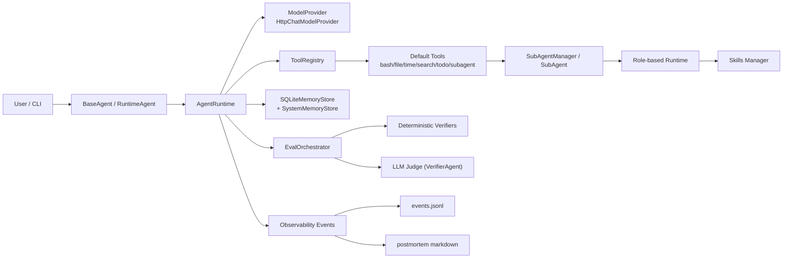

# InDepth 技术架构说明

InDepth 是一个以“可执行、可观测、可验证”为目标的本地 Agent Runtime 项目。  
它不是对话壳，而是一个包含运行时调度、工具调用、子代理协同、结果验证、观测复盘与记忆闭环的工程化系统。

---

## 1. 项目目标

本项目主要解决 3 个工程问题：

1. 如何把 LLM 对话转成可执行流程（Tool Calling + Runtime Loop）
2. 如何让执行过程可审计（事件埋点 + 指标聚合 + 时间线）
3. 如何让“回答完成”与“任务完成”区分开（Eval + VerifierAgent）

对应代码主线：

- 运行时：`app/core/runtime/*`
- 工具体系：`app/core/tools/*` + `app/tool/*`
- 评估体系：`app/eval/*`
- 可观测性：`app/observability/*`
- 记忆体系：`app/core/memory/*`

---

## 2. 快速开始

### 2.1 三步跑通

1. 安装依赖
   - `pip install -r requirements.txt`
2. 配置模型环境变量
   - `LLM_MODEL_ID` / `LLM_MODEL_MINI_ID`
   - `LLM_API_KEY` / `LLM_BASE_URL`
3. 启动 Runtime CLI
   - `python app/agent/runtime_agent.py`

### 2.2 参考文档（Refer）

README 仅保留总览，具体技术实现细节统一放在 `doc/refer/`：

| 文档 | 说明 |
|------|------|
| [总索引](doc/refer/README.md) | 文档索引与阅读顺序 |
| [架构参考](doc/refer/architecture-reference.md) | 系统整体架构、模块设计、技术选型 |
| [Runtime](doc/refer/runtime-reference.md) | AgentRuntime 主循环、收敛逻辑 |
| [记忆模块](doc/refer/memory-reference.md) | 运行时压缩、结构化摘要、系统记忆 |
| [Tools](doc/refer/tools-reference.md) | 工具声明/注册/调用链 |
| [Eval](doc/refer/eval-reference.md) | 任务评估模型、verifier 链路 |
| [Observability](doc/refer/observability-reference.md) | 事件模型、postmortem 生成 |
| [Agent 协同](doc/refer/agent-collaboration-reference.md) | 主从 Agent 协同、角色路由 |
| [配置](doc/refer/config-reference.md) | 模型配置、压缩配置、环境变量 |

### 2.3 实现级参考（概要）

以下为当前实现对齐的核心事实，详细说明见 `doc/refer/`。

1. Runtime（`app/core/runtime/agent_runtime.py`）
   - 主循环：`system + history + user -> model -> tool_calls/stop -> 收敛`
   - 支持 run 内压缩触发（轮次 / token / 工具突发）与 run 末 `compact_final()`
   - 结束后事件顺序：`task_finished -> verification_* -> task_judged`
   - 任务结束强制沉淀一条 `postmortem` stage 的系统记忆卡

2. Memory（`app/core/memory/*`）
   - Runtime memory：`messages` + `summaries(summary_json)` 双表
   - 压缩器：`ContextCompressor(v1)` 维护 `task_state/constraints/decisions/artifacts/anchors`
   - 一致性守护：可阻断压缩（`COMPACTION_CONSISTENCY_GUARD=true`）
   - System memory：`db/system_memory.db::memory_card`，支持 upsert/search/due-review

3. Tools（`app/core/tools/*` + `app/tool/*`）
   - 标准链路：`@tool -> registry -> validator -> invoke`
   - 默认工具包含：bash、文件读写、时间、search guard、subagent、todo、runtime memory harvest
   - 直接搜索工具（`ddg_search/url_search/baidu_search`）已废弃，统一走 search guard
   - SubAgent 角色工具隔离：`researcher/builder/reviewer/verifier/general` 能力不同

4. Eval（`app/eval/*`）
   - 默认 deterministic verifiers：`StopReasonVerifier + ToolFailureVerifier`
   - 可选 LLM judge：`VerifierAgent`（软评分，不作为硬失败）
   - 判定输出：`RunJudgement(pass/partial/fail, overclaim, verifier_breakdown)`

5. Observability（`app/observability/*`）
   - 事件统一写入 `app/observability/data/events.jsonl`
   - 记忆事件额外写入 SQLite：`memory_trigger/retrieval/decision` 三表
   - `task_finished` 与 `task_judged` 会自动触发 postmortem 生成/覆盖
   - 输出路径：`observability-evals/<task_id>__<run_id>/postmortem.md`

6. Agent 协同（`app/agent/*` + `app/tool/sub_agent_tool/*`）
   - `create_sub_agent` 强制显式 role 路由
   - `reviewer/verifier` 创建时必须提供 `acceptance_criteria` 与 `output_format`
   - `SubAgentManager` 提供同步、异步、并行执行与生命周期管理

7. Config（`app/config/runtime_config.py`）
   - 模型配置必填：`LLM_MODEL_ID/LLM_MODEL_MINI_ID/LLM_API_KEY/LLM_BASE_URL`
   - 压缩配置可调：`ENABLE_MID_RUN_COMPACTION` 与 `COMPACTION_*` 系列阈值
   - Provider 采用 OpenAI-compatible `/chat/completions` 协议并带重试退避

---

## 3. 分层架构总览



### L1 协议与目标层（Why）

- 位置：`InDepth.md`
- 职责：定义任务启动、时效检索、拆解边界、收敛标准、风险门禁。

### L2 编排与运行时层（How）

- 位置：`app/agent/*` + `app/core/runtime/*`
- 职责：管理多步推理循环、tool-calling、失败收敛、执行追踪。

### L3 能力执行层（Do）

- 位置：`app/core/tools/*` + `app/tool/*` + `app/core/skills/*`
- 职责：提供可组合能力（工具、子代理、技能、todo 工作流）。

### L4 评估与观测层（Check）

- 位置：`app/eval/*` + `app/observability/*`
- 职责：区分“回答完成”和“任务完成”，沉淀可审计执行证据。

### L5 记忆与资产层（Learn）

- 位置：`app/core/memory/*` + `db/*`
- 职责：管理会话记忆、系统记忆与经验卡沉淀。

---

## 4. 目录概览

```text
app/
  agent/                 # BaseAgent、SubAgent、CLI 入口
  core/
    runtime/             # AgentRuntime 主循环
    model/               # 模型适配层
    tools/               # 工具协议/注册/校验
    memory/              # 记忆存储与压缩
    skills/              # 技能加载与管理
  tool/                  # 具体工具实现
  eval/                  # 任务评估体系
  observability/         # 观测、指标、复盘
  skills/                # 项目内技能
db/                      # runtime + system memory sqlite 文件
todo/                    # todo markdown 任务文件
work/                    # 业务交付物输出
observability-evals/     # 评估/复盘输出
InDepth.md               # 运行协议（行为约束）
```
