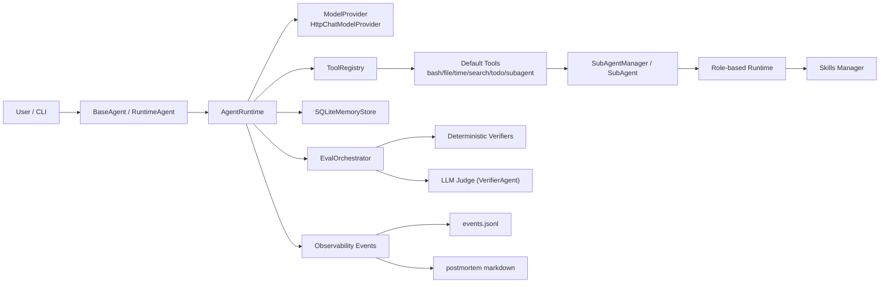

# InDepth 技术架构说明

InDepth 是一个以“可执行、可观测、可验证”为核心目标的本地 Agent Runtime 项目。  
它不是单纯的对话壳，而是一个包含 **运行时调度、工具调用、子代理协同、结果验证、观测复盘、记忆压缩** 的最小可用闭环。

---

## 1. 项目目标

本项目主要解决 3 个工程问题：

1. 如何把 LLM 对话转成可执行流程（Tool Calling + Runtime Loop）
2. 如何让执行过程可审计（事件埋点 + 指标聚合 + 时间线）
3. 如何让“回答完成”与“任务完成”区分开（Eval + VerifierAgent）

对应代码主线：

- 运行时：`app/core/runtime/agent_runtime.py`
- 工具体系：`app/core/tools/*` + `app/tool/*`
- 评估体系：`app/eval/*`
- 可观测性：`app/observability/*`
- 记忆体系：`app/core/memory/*`

---

## 2. 总体架构



### 分层说明

- 接入层：`app/agent/*.py`（CLI 与 Agent 封装）
- 运行时层：`app/core/runtime`（步进执行、tool_calls、收敛策略）
- 能力层：`app/tool` + `app/core/skills`（工具与技能）
- 评估层：`app/eval`（硬规则 + 软评分）
- 观测层：`app/observability`（事件、指标、复盘）
- 状态层：`app/core/memory` + `db/`（会话记忆）

---

## 3. 端到端执行链路

一次标准调用（`runtime.run(...)`）的时序如下：

1. 构建消息上下文  
   - system prompt = Runtime 基础提示 + 业务提示 + skill prompt
   - 读取历史消息（`SQLiteMemoryStore.get_recent_messages`）
2. 拉取工具 schema 并请求模型  
   - `ModelProvider.generate(messages, tools, config)`
3. 解析模型 finish_reason  
   - `tool_calls`：执行工具并将工具结果回注到消息
   - `stop`：作为最终答案收敛
   - `length/content_filter/error`：按失败路径收敛
4. 执行后评估  
   - `EvalOrchestrator.evaluate(...)`
   - 默认硬校验：停止原因、工具失败
   - 可选软校验：VerifierAgent（LLM Judge）
5. 记录观测事件并触发复盘  
   - `emit_event(...)` 写入 JSONL
   - `task_finished` 时自动生成 postmortem
6. 记忆压缩  
   - 写入消息后触发 `compact(...)`，保留近期消息并归档摘要

---

## 4. 核心模块拆解

### 4.1 Runtime：`app/core/runtime/agent_runtime.py`

职责：

- 管理多步推理与工具调用循环（`max_steps`）
- 处理 OpenAI-compatible `finish_reason`
- 统一错误收敛文案与停止原因
- 串联执行后评估（EvalOrchestrator）

关键点：

- 工具调用只走原生 tool-calling（`tool_calls`）
- 失败原因结构化保存：`last_tool_failures`
- 支持 trace 输出（默认打印每步状态）

---

### 4.2 Model 适配：`app/core/model/*`

- 协议定义：`ModelProvider`（`generate(messages, tools, config)`）
- 生产实现：`HttpChatModelProvider`
- 测试实现：`MockModelProvider`

`HttpChatModelProvider` 特性：

- OpenAI-compatible `/chat/completions`
- 可配置重试与指数退避
- 自动转换 tools schema 到 function-calling 格式
- `GenerationConfig` 支持温度、top_p、penalty、seed、max_tokens 等参数

---

### 4.3 Tool 框架：`app/core/tools/*`

- 声明：`@tool(...)`（`decorator.py`）
- 注册：`ToolRegistry.register`
- 调用：`ToolRegistry.invoke`
- 参数校验：`validator.validate_args`（轻量 JSON Schema 子集）

默认工具装配入口：

- `build_default_registry()` in `app/core/tools/adapters.py`

默认包含：

- Bash / 文件读写 / 时间
- 搜索门禁工具（Search Guard）
- SubAgent 管理工具
- Todo 工作流工具

---

### 4.4 SubAgent 协同：`app/tool/sub_agent_tool/*` + `app/agent/sub_agent.py`

### 角色模型

固定角色：

- `general`
- `researcher`
- `builder`
- `reviewer`
- `verifier`

每个角色有不同工具权限组合（例如 reviewer 默认不提供写文件能力）。

### 管理机制

- `SubAgentManager` 单例维护 Agent 池
- 支持同步执行与 asyncio 并行执行
- 统一记录 subagent 生命周期事件（created/started/finished/failed）

---

### 4.5 Todo 工作流：`app/tool/todo_tool/todo_tool.py`

职责：

- 任务拆解落盘到 `todo/*.md`
- 子任务状态迁移（pending/in-progress/completed）
- 依赖阻塞检查（未完成依赖不可推进）
- 进度与依赖段自动回写

特点：

- 文件格式可读（Markdown）
- 状态机具备最小一致性约束

---

### 4.6 搜索门禁：`app/tool/search_tool/search_guard.py`

目标：把“时效检索”从开放式搜索改为预算受控搜索。

机制：

- 先 `init_search_guard` 初始化 session
- 强制时间基准、问题清单、轮次预算、时长预算、停止阈值
- 每轮更新进度与证据覆盖率
- 达到阈值后自动停止

这部分与 `InDepth.md` 中的“时效信息协议”一一对应。

---

### 4.7 Skills 体系：`app/core/skills/*`

项目内存在两套技能接入方式：

1. 轻量 Skill Prompt（`app/core/skills/loader.py`）  
   - 读取 `SKILL.md`，提取标题与摘要注入 system prompt
2. Agno-style Skills Manager（`app/core/skills/manager.py`）  
   - 动态暴露工具：`get_skill_instructions / get_skill_reference / get_skill_script`
   - 允许按需读取 references/scripts，避免一次性注入全部内容

---

### 4.8 记忆层：`app/core/memory/sqlite_memory_store.py`

存储结构：

- `messages`：完整消息序列
- `summaries`：历史摘要

压缩策略：

- 超过阈值后，仅保留最近 `keep_recent` 条消息
- 旧消息合并为摘要写入 `summaries`

兼容策略：

- 历史 `tool` 角色消息迁移为 `assistant` 文本块，避免下游模型 payload 不兼容

---

### 4.9 评估层：`app/eval/*`

### 数据结构

- `TaskSpec`：目标、约束、工件期望、软评分阈值
- `RunOutcome`：本次运行输出、停止原因、工具失败
- `RunJudgement`：最终判定与 verifier 分项

### 编排逻辑

`EvalOrchestrator` 聚合多 verifier：

- 硬校验失败 => `final_status=fail`
- 硬校验通过但软分低于阈值 => `final_status=partial`
- 否则 `pass`

另外内置 `self_reported_success` 推断与 `overclaim`（自报成功但验证失败）判断。

---

### 4.10 可观测性：`app/observability/*`

核心闭环：

1. `emit_event`：事件采集
2. `EventStore`：JSONL 落盘
3. `aggregate_task_metrics`：指标聚合
4. `build_trace`：执行时间线
5. `generate_postmortem`：复盘文档输出

落盘位置：

- 事件：`app/observability/data/events.jsonl`
- 复盘：`work/observability-postmortems/postmortem_*.md`

自动化机制：

- 当事件类型为 `task_finished`，自动触发 postmortem（best-effort，不阻塞主流程）

---

## 5. 目录与数据落点

```text
app/
  agent/                 # BaseAgent、SubAgent、CLI 入口
  core/
    runtime/             # AgentRuntime 主循环
    model/               # 模型适配层
    tools/               # 工具协议/注册/校验
    memory/              # SQLite 记忆存储
    skills/              # 技能加载与管理
  tool/                  # 具体工具实现（todo/search/subagent/file/bash）
  eval/                  # 任务评估体系
  observability/         # 观测、指标、复盘
db/                      # runtime memory sqlite 文件
todo/                    # todo markdown 任务文件
work/                    # 交付物与观测复盘输出
InDepth.md               # 运行协议（行为约束）
```

---

## 6. 配置与启动

### 6.1 安装

```bash
pip install -r requirements.txt
```

### 6.2 环境变量

运行模型配置读取顺序（优先 `CODEX_*`，后备 `LLM_*`）：

- `CODEX_MODEL_ID` / `LLM_MODEL_ID`
- `CODEX_MODEL_MINI_ID` / `LLM_MODEL_MINI_ID`（缺省回退主模型）
- `CODEX_API_KEY` / `LLM_API_KEY`
- `CODEX_BASE_URL` / `LLM_BASE_URL`

### 6.3 运行

```bash
python app/agent/runtime_agent.py
```

或：

```bash
python app/agent/agent.py
```

---

## 7. 扩展指南

### 7.1 新增 Tool

1. 在 `app/tool/...` 中用 `@tool` 定义函数
2. 在 `build_default_registry()` 或相应 Agent 注册逻辑中接入
3. 补参数 schema（避免运行期校验失败）
4. 补事件埋点（建议）

### 7.2 新增 Skill

1. 新建 `SKILL.md`
2. 如需脚本与资料，增加 `scripts/`、`references/`
3. 通过 `SkillLoader` 或 `Skills(LocalSkills(...))` 接入

### 7.3 新增 Verifier

1. 实现 `Verifier` 接口（`verify(task_spec, run_outcome)`）
2. 在 `EvalOrchestrator` 中拼接到 verifier chain
3. 为 `VerifierResult` 提供可解释 reason/evidence

---

## 8. 设计取舍与当前边界

当前架构优先“工程闭环完整性”，不是“单点能力最强”：

- 优点：
  - 执行可追溯（events + trace）
  - 结果可复核（deterministic + llm judge）
  - 可扩展路径清晰（tool/skill/verifier 插拔）
- 边界：
  - Tool schema 校验仍是轻量子集，不是完整 JSON Schema
  - SubAgent 隔离度主要靠角色与工具白名单，尚未引入更细粒度沙箱
  - 记忆摘要为规则压缩，未引入语义级长期记忆检索

---

## 9. 相关文档

- 运行协议：`InDepth.md`
- 可观测性模块说明：`app/observability/README.md`
- 技能样例：`app/skills/*/SKILL.md`
